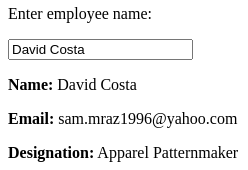

# API with PHP in Docker

A simple API with PHP that will query MySQL Database and get data

MySQL already has simple database included in a ***mysql/test.sql*** file

## Deployment

Use [Docker Compose](https://docs.docker.com/compose/install/) to deploy the application locally

```bash
# clone repository
git clone https://github.com/kemosabe-afk/docker-api.git

# cd into repository
cd docker-api

# deploy application
docker-compose up
```

## Usage

Test the application in a web browser: [localhost](http://localhost)

Just enter the full name of any employee in the field to get information about him, for example:


You can view the entire table included in the MySQL database [here](http://localhost/api/index.php).